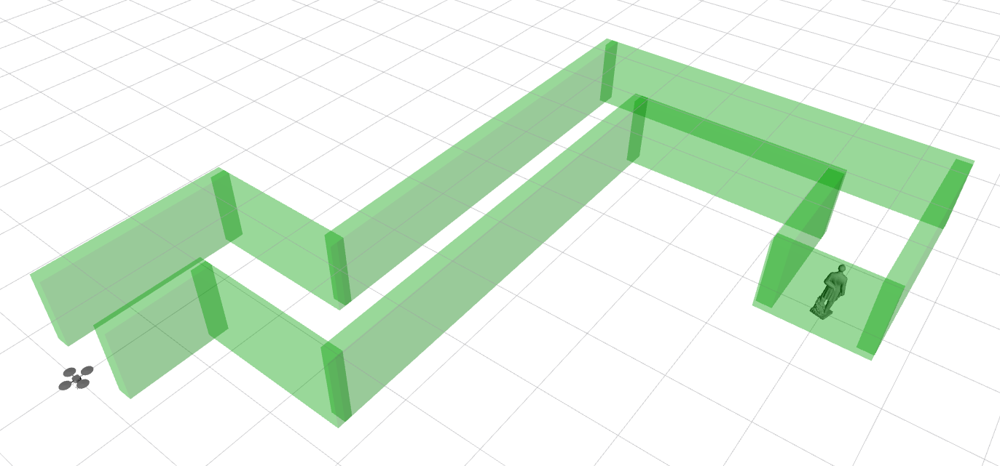

# MAGICC Lab Onboarding Project

Welcome! This repository contains an onboarding project designed to introduce you to the tools, workflows, and concepts used in the MAGICC Lab.

## Purpose
This is a fun, hands-on project that typically takes about 2 weeks to complete. It's designed for prospective students and volunteers who want to learn what we do in the MAGICC lab—no prior autopilot or robotics experience required!

> [!NOTE]
> **Time Estimate:** Approximately 2 weeks if you spend 10 hours/week. This estimate assumes you have some coding experience (Python or C++) but are new to our lab's tools and workflows.
> If you have less time available each week, adjust your timeline accordingly. Don't rush—learning these concepts thoroughly is more important than speed!

### What You'll Learn

By completing this project, you will:

* **Gain hands-on experience with:**
  * [ROS 2](https://docs.ros.org/en/humble/index.html) – A robotics middleware framework used widely in research and industry
  * `git` – Version control for collaborative software development
  * Python or C++ – Your choice for implementing the controller
  * Linux – The operating system environment used in robotics research
  * (optional) Docker – Containerization for reproducible development environments
* **Set up ROSflight** – Install and configure an autopilot system and simulator on your computer
* **Build a real controller** – Write your own ROS 2 node to autonomously navigate a simulated quadrotor
* **Have fun!** – Solve a challenge, compete on the leaderboard, and gain practical skills

> [!NOTE]
> **What is ROSflight?**
> [ROSflight](https://docs.rosflight.org) is an open-source autopilot built from scratch here in the MAGICC lab. Unlike many commercial autopilots, ROSflight is designed to be understandable and extensible, making it ideal for learning about drone control, estimation, and autopilot design.
>
> In this project, you'll install ROSflight and its companion simulator, then write code to control a virtual quadrotor. This mirrors the workflow researchers use to develop and test new algorithms before flying real hardware.

## The Mission

Mr. Karl Maeser has unfortunately found himself stuck inside a chalk circle, and hasn't been able to find any BYU Creamery chocolate milk for days!
He is located at the end of a hallway, unable to move.

Luckily, you happen to have a quadrotor that just happens to have a case of BYU Creamery chocolate milk already loaded up.
Your assignment is to deliver the goods to Mr. Maeser as quick as you can.
But watch out!
Hit any walls and your quadrotor will crash (not shown)!

#### Your Task:
Design and implement a controller that:
- Autonomously navigates through the simulated hallway
- Avoids collisions with all walls
- Reaches Mr. Maeser's location efficiently

#### Deliverables:
- A video link of your quadrotor completing the mission (screen recording, uploaded to YouTube or similar)
- The minimum distance to the walls and completion time from your run (automatically computed by this package)
- A link to your forked repository with your solution code

## Getting Started

1. Follow the [project instructions](docs/project-instructions.md) to complete your project.
2. After successfully getting Mr. Maeser his goods, [submit your results to the leaderboard](docs/leaderboard-instructions.md).

## Leaderboard
Ranked list of successful solutions.
Solutions are ranked by

$$\text{Score} = \frac{\text{Minimum Distance From Walls (m)}}{\text{Time (s)}}$$

**Higher scores are better!** This means:
- Staying farther from walls (safer flight) increases your score
- Completing the mission faster also increases your score
- You need to balance speed and safety for the best ranking

<!-- LEADERBOARD:START -->
<!-- The leaderboard below is automatically generated. Do not edit manually. -->
| Rank | Name | Minimum distance from walls (m) | Best time (s) | GitHub | Video Link |
|------|------|------------------|----------------|---------|----------|
| 1 | Ole Warndahl | 2.83 | 26.7 | [repo](https://github.com/warndahlo/onboarding_project) | [video](https://youtu.be/Z7cgAcRzzUU?si=VBFusDM3DtBzlxsN) |
| 2 | Cosmo | 2.5 | 44.5 | [repo](https://github.com/byu-magicc/onboarding_project) | [video](https://youtu.be/GJZMzQYB5zI) |
| 3 | Preston Nielson | 1.22 | 143.2 | [repo](https://github.com/PrestonTNielson/Prestons_onboarding_project) | [video](https://www.youtube.com/watch?v=EFsVFm7LLr0) |

<!-- LEADERBOARD:END -->
